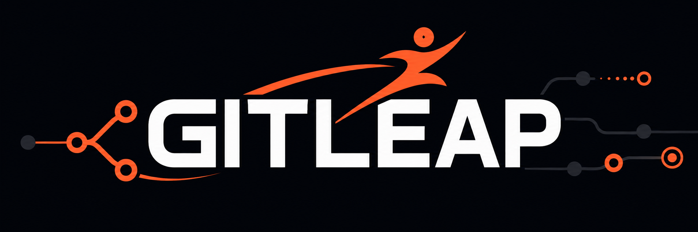

<div align="center">
  
</div>

<div align="center">
  <p><strong>Leap from idea to delivery.</strong></p>
  <p>A modern Git workflow platform for faster, safer, and more reliable software development.</p>

  <p>
    <a href="#features">Features</a> ·
    <a href="#how-it-works">How It Works</a> ·
    <a href="#getting-started">Getting Started</a> ·
    <a href="#contributing">Contributing</a>
  </p>
</div>

---

## Overview

GitLeap helps developers move confidently through the software development lifecycle from creating changes and managing branches to validating code, reviewing work, and delivering releases.

It is designed for individual developers, open-source maintainers, and engineering teams that want Git workflows to be more organized, automated, and reliable.

## Features

| Feature | Description |
| --- | --- |
| Git workflows | Manage repository changes, branches, commits, and delivery processes. |
| Developer automation | Reduce repetitive tasks with consistent and repeatable workflows. |
| Code validation | Support formatting, linting, type checking, tests, builds, and security checks. |
| Safe delivery | Make changes visible, reviewable, and verifiable before they move forward. |
| Extensible architecture | Build and share functionality through reusable applications and packages. |
| Open-source collaboration | Create a transparent foundation for community contributions and improvements. |

## Getting Started

### Prerequisites

- Git
- Bun/npm/pnpm/powershell
- Access to any environment variables required by the selected application

### Installation

```curl -sL https://gitleap.com | sh && gitleap auth login <token>```

## Step 1: Initiating the Leap
Instead of swapping a domain in a browser, a developer passes any public GitHub repository URL directly to the CLI client:

`$ gitleap pull https://github.com/user/repo`
``` example  
 🧭 GitLeap Pipeline: https://github.com/<org>/repo
 ──────────────────────────────────────────────────────────────────────  
 [████████████████░░░░░░░░░░░░░░░░░░] 45% Refactoring Codebase Primitives  
 ──────────────────────────────────────────────────────────────────────  
 🖥️  [DONE] Ingested repository source stream.  
 🌳  [DONE] Tree-sitter built abstract syntax tree (AST).  
 🧠  [BUSY] Map-Reduce AI processing: Refactoring module 2 of 4...  
 📦  [WAIT] Synthesizing skills-manifest.json configuration.  
 ──────────────────────────────────────────────────────────────────────  
 (Press Esc to abort and cancel background worker)
```

## Step 2: To view dashboard
Once compilation reaches 100%, the screen clears, and the user is dropped into an interactive, multi-pane terminal split. They navigate it smoothly using their arrow keys or Vim hotkeys (j/k).
``` example
 GitLeap Explorer ── <org>/<example-repo> ─────────────────── (q: exit / d: download)  
[ Skills ]  Schema Config   Blueprint Engine   System Diagnostics
╭─ Skills List (4 Cols) ────╮╭─ Schema Detail (8 Cols) ────────────────────────╮
│ ❯ 🔹 code-slicing         ││ ⚙ Object Model: skill-manifest.json              │
│   🔹 ast-refactor         ││   ├─ Capability Tag: [ SKILL ]                  │
│   🔹 telemetry-agent      ││   ├─ Entry Point: src/skills/slicing.ts         │
│   🔹 pipeline-router      ││   ╰─ AST Mode: Strict Compilation Parsing       │
│                           ││                                                 │
│ 📂 core/                  ││ System Metrics:                                 │
│   🔹 token-engine.ts      ││ ░░░░░░░░░░░░░████████▓▓▓▒▒░░░░░░░░░░░░░░░░░░░   │
│   🔹 grid-canvas.ts       ││ Transmuting AST Nodes: 12,408 / 18,900 [65%]     │
╰───────────────────────────╯╰─────────────────────────────────────────────────╯
╭─ Code Blueprint Preview (Collapsible) ───────────────────────────────────────╮
│ 1 │ export function calculateSheenStep(tickCounter: number): SheenState {    │
│ 2 │   const normalizedPeriod = SHEEN_CONFIG.SHEEN_MAX;                       │
│ 3 │   const currentStep = (tickCounter * SHEEN_CONFIG.SHEEN_SPEED);          │
│ 4 │   return { sheenCenter: currentStep % normalizedPeriod };                │
│ 5 │ }                                                                        │
╰──────────────────────────────────────────────────────────────────────────────╯
[d] Download Archive  │  [i] Inject into Active Project  │  [Ctrl+C] Abort │  ↕ / j/k Nav  │  c Toggle Preview
```

## How It Works

GitLeap follows a simple development flow:

When a user initiates the URL swap **(://github.com... ➔ ://gitleap.com...)**, the system splits the heavy structural analysis and AI code refactoring into isolated, asynchronous execution stages.

### Universal Skill Factory 
> any legacy GitHub repository into a downloadable, production-grade skills.sh-compliant pack on the fly.
```
[ A messy, unstructured GitHub repository URL ]
                       │
                       ▼ (gitleap.com)
┌────────────────────────────────────────────────────────────────────────┐
│ 1. THE INGESTION LAYER                                                 │
│    Streams raw code, scripts, and documentation into the pipeline.     │
├────────────────────────────────────────────────────────────────────────┘
│ 2. THE AI SYNTHESIS LAYER                                              │
│    An LLM dynamically refactors code into strict canonical primitives. │
├────────────────────────────────────────────────────────────────────────┘
│ 3. THE COMPLIANT COMPILER                                              │
│    Auto-generates the exact schema structure required by skills.sh.    │
└────────────────────────────────────────────────────────────────────────┘
                       │
                       ▼
[ Instant Output: A valid 'npx skills' ready pack tailored to your tool ]
```

## Skill Name: [Generated Capability]
A dynamically extracted skill to execute specific production tasks.

### Description
[AI-optimized description to improve agent triggering accuracy]

### Usage
```$ gitleap run [skill-id] --param="value"```
### Installation
```$ npx skills add https://gitleap.com/[auto-generated-id] --skill -y```

[READ MORE](./docs/README.md)

## Contributing

Contributions are welcome.

1. Read [`AGENTS.md`](./AGENTS.md) before making changes.
2. Create a focused branch.
3. Make the smallest change that solves the problem.
4. Add or update tests.
5. Run formatting, linting, type checking, tests, builds, and security checks.
6. Update documentation when behavior or configuration changes.
7. Open a pull request with a clear description and verification details.

## Security

Please do not report security vulnerabilities through public issues.

Read [`SECURITY.md`](./SECURITY.md) for the responsible disclosure process. Never include real credentials or sensitive information in issues, pull requests, logs, screenshots, or test fixtures.

## Code of Conduct

Please read [`CODE_OF_CONDUCT.md`](./CODE_OF_CONDUCT.md) before participating in the project.

## License

GitLeap is licensed under the [MIT License](./LICENSE).

---

<div align="center">
  <sub>Built for developers who want to move fast without losing confidence.</sub>
</div>
