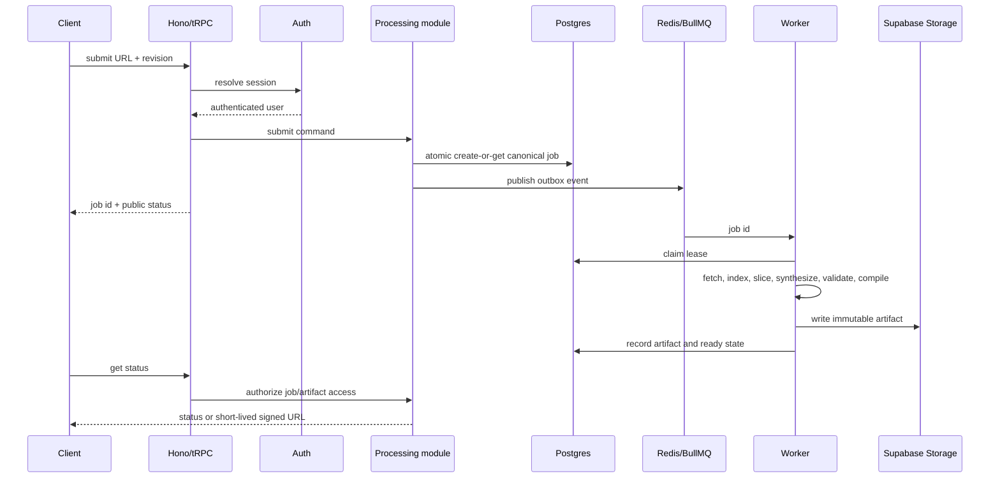

# GitLeap Architecture

## Overview

GitLeap is a TypeScript-first Bun/Turborepo monorepo. The current repository contains a React web client, Hono server, Better Auth, Prisma, OpenTelemetry, Fumadocs, a durable repository-processing MVP kernel, and a separate production worker.

## Design Goals

- keep transport thin
- keep domain state durable
- keep provider differences in adapters
- parse source without executing it
- make output reproducible and inspectable
- make authorization and artifact ownership explicit
- defer infrastructure until the first real load requirement

## Layer Model

### Layer A: Client surfaces

- `apps/cli`: first product client with token/session authentication, scripted submission/status/cancellation/download commands, and the integrated OpenTUI Step A/B/C flow
- `apps/web`: browser onboarding, submission, status, and download over the same contract
- `apps/fumadocs`: canonical published documentation

The CLI interactive console is implemented with OpenTUI. Its framework-agnostic
design tokens and keyboard math are owned by `@gitleap/design` and re-exported
by `apps/cli/src/theme.ts`; the interaction contract is covered by the CLI and
design package tests.

### Layer B: Transport

- `apps/server/src/index.ts`: Hono lifecycle, CORS, auth route, tRPC mount, tracing
- `packages/api`: context, public/protected procedures, typed request contract

The transport layer validates input, authorization, and public projections.
Retry, queue, lease, and stage execution remain in
`apps/server/src/processing`; transport lifecycle queries use the same Postgres
contracts until a shared processing package is justified.

### Layer C: Domain processing

Implemented module: `apps/server/src/processing`.

Responsibilities:

- canonical source identity
- job submission and deduplication
- state transitions
- stage orchestration
- retry classification
- artifact readiness
- public status projection

### Layer D: Adapters

- GitHub source adapter
- Prisma job store
- BullMQ/Redis queue adapter
- deterministic `v1-lexical` static indexer
- model adapter
- Supabase Storage artifact adapter

### Layer E: Persistence and infrastructure

- Supabase Postgres via Prisma
- Supabase Storage
- Redis or Upstash Redis
- OpenTelemetry and application event telemetry

Client polling is a presentation concern: the CLI uses a fixed interval and
the web client uses bounded backoff intervals. Both project the same public
status contract; streaming is deferred.

## Monorepo Structure

```text
apps/
  cli/                  OpenTUI interactive and command-line client
  web/                  browser client
  server/               Hono and tRPC ingress
  fumadocs/             canonical documentation application
packages/
  api/                  transport contract
  auth/                 Better Auth and Stripe helpers
  db/                   Prisma client and schema
  env/                  environment validation
  config/               shared private configuration
  design/               framework-agnostic tokens, sheen math, and navigation
  oss-integrations/     Repomix and upstream writing-skill adapters
docs/                   architecture and product records
.internal/reference/    private pattern corpus
```

## Request Flow



## State and Failure Model

```text
Job state is authoritative as `queued -> claimed -> processing -> ready`, with
`queued/claimed/processing -> cancel_requested -> cancelled`, retryable failure
returning to `queued`, terminal failure becoming `failed`, and `ready ->
expired`. The names `fetched`, `indexed`, `sliced`, `synthesized`,
`validated-output`, `compiled`, and `stored` are `JobStage` values, not job
states. The CLI renders these stages through fixed-interval polling; it does not use a
WebSocket transport today.
```

Retryable failures return to `queued` with incremented attempt and backoff. Terminal failures become `failed` with a safe error code. Worker leases and monotonic versions prevent stale workers from changing terminal state.

## Persistence Shape

The database schema contains Better Auth and the processing kernel:

| Record           | Required purpose                                                                                           |
| ---------------- | ---------------------------------------------------------------------------------------------------------- |
| `ProcessingJob`  | source identity reference, public state, attempts, lease, timestamps                                       |
| `JobAccess`      | user, role (`owner`/`reader`), grant and revoke timestamps                                                 |
| `SourceIdentity` | canonical provider/repository/commit/pipeline/options digest; one active-attempt partial unique constraint |
| `ConsumerInbox`  | durable event IDs already accepted by a worker                                                             |
| `JobStage`       | stage input/output digest, state, timing, safe error                                                       |
| `Artifact`       | storage key, checksum, size, provenance, expiry                                                            |
| `OutboxEvent`    | recoverable queue publication                                                                              |
| `UsageRecord`    | repository, model, token, compute, and storage accounting                                                  |
| `AuditEvent`     | creation, access, cancellation, failure, and download events                                               |

## Internal Modules

### Identity module

Normalizes provider URLs, resolves revisions, computes canonical keys, and rejects unsupported inputs.

### Policy module

Applies authentication, ownership, quota, repository limits, SSRF protection, and content policy.

### Orchestrator module

Coordinates stages and transitions. It should not know vendor-specific HTTP or storage details.

### Index module

Produces a deterministic repository index with path and symbol evidence.

### Slicing module

Selects bounded semantic contexts and records why each file or symbol was included.

### Synthesis module

Calls the model adapter and validates structured candidates.

### Compiler module

Builds skills, manifest, provenance, archive, checksum, and validation report.

## Authorization Model

- session authentication is server-authoritative
- every job has an owner access row
- status/download require `owner` or `reader`; cancellation requires `owner`
- no access row means no authorization
- signed URLs are issued only after authorization
- object keys are never treated as authorization

## Security Model

- source is untrusted text
- repository code is never executed
- archive traversal and resource exhaustion are rejected
- external fetches are allowlisted and egress-restricted
- model prompts and source are retained only under an explicit policy
- generated artifacts are scanned before publication
- logs contain identifiers and safe error codes, not source or credentials

## Observability

Every job should emit structured events with:

- job ID
- canonical key hash, not raw sensitive input
- owner or tenant ID
- state transition
- stage
- attempt
- duration
- resource usage
- safe error code

OpenTelemetry traces should follow a job across ingress, queue, worker, source, model, compiler, and storage operations. High-cardinality source content does not belong in metric labels.

## Architectural Rules

1. Do not put queue calls directly in tRPC procedures.
2. Do not put provider-specific fields in public domain types.
3. Do not use Redis as the source of truth for job identity.
4. Do not publish `ready` before artifact persistence succeeds.
5. Do not introduce a second documentation product; use `apps/fumadocs`.
6. Do not add a generic interface with only one implementation unless it is required for isolation or testing.
