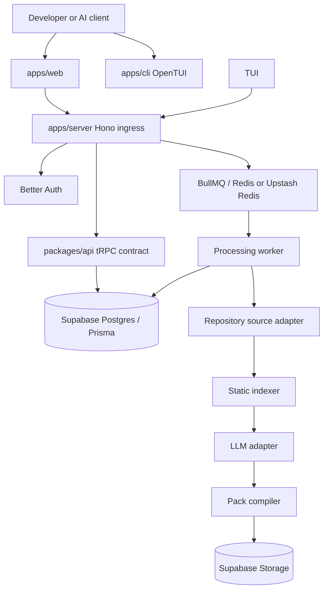

# GitLeap Technical Architecture

> `TA.md` is the deepest single-file technical architecture reference for GitLeap. It defines the product claim, system model, current repository evidence, target processing contract, monorepo structure, adapter rules, security posture, delivery model, and implementation sequence.

> This is a documentation-first design. Sections marked **Implemented** describe code currently present in the repository. Sections marked **Planned** describe the target system and are not claims about shipped behavior.

## 1. Executive Definition

GitLeap transforms a repository at a pinned commit into a downloadable, skills.sh-compatible capability pack.

The intended user experience is:

```text
repository URL + commit
        -> deterministic structural analysis
        -> semantic capability extraction
        -> validated skill files and setup scripts
        -> immutable .tar.gz artifact
```

GitLeap is not a general-purpose code migration service. Its first product contract is narrower:

- accept a supported public Git repository and immutable commit
- inspect source as untrusted text
- map files, symbols, imports, and entry points
- extract coherent implementation capabilities
- generate explicit `SKILL.md`, manifest, setup, and validation files
- publish a reproducible artifact with status and provenance

## 2. Product Mission

GitLeap reduces the distance between an existing repository and a useful, portable development skill pack without requiring an engineer to manually read the whole repository first.

### Mission outcomes

| Outcome | Meaning |
| --- | --- |
| Fast discovery | A URL and commit produce a useful repository map before model work starts. |
| Faithful extraction | Generated skills preserve repository-supported patterns instead of inventing behavior. |
| Safe processing | Repository content is parsed as data and never executed by the ingestion pipeline. |
| Reproducible output | The same source, pipeline version, and configuration produce the same artifact identity. |
| Useful delivery | The result is a valid archive with manifest, instructions, references, and local checks. |

## 3. Problem Statement

Large repositories contain valuable implementation knowledge, but sending the entire tree to an LLM is expensive, slow, and inaccurate. A repository also contains noise, generated files, secrets, tests, vendored code, and untrusted instructions.

The system problem is therefore a pipeline problem, not a prompt-only problem:

1. establish repository identity
2. build a deterministic structural map
3. reduce the source into bounded semantic slices
4. synthesize candidate skills under explicit rules
5. validate syntax, structure, references, and security
6. compile one portable artifact

## 4. Architecture Thesis

| Thesis | Consequence |
| --- | --- |
| Static analysis before model work | Tree-sitter or equivalent parsing owns structure; the LLM does not discover the whole tree from raw text. |
| Source is untrusted data | No repository scripts, package managers, build hooks, or generated code execute in the worker. |
| One canonical job identity | Database uniqueness and deterministic keys prevent duplicate processing. |
| Thin transport | Hono and tRPC expose commands and queries; they do not own pipeline orchestration. |
| Deep processing module | State transitions, retries, stage outputs, and adapters remain behind one domain module. |
| Explicit capability output | Every generated skill states scope, prerequisites, inputs, outputs, and validation. |
| Evidence over invention | Generated content must cite source paths and distinguish observed behavior from recommendation. |
| TypeScript first | Runtime code and contracts use TypeScript; external services are consumed through stable protocols. |

## 5. Current Repository Evidence

### Implemented applications

| Application | Current role | Entry points |
| --- | --- | --- |
| `apps/cli` | First TypeScript/Bun client for login, submission, status, cancellation, and download | `src/index.ts`, `src/client.ts` |
| `apps/web` | Vite React client with React Router, TanStack Query, and tRPC | `src/main.tsx`, `src/router.tsx`, `src/app-shell.tsx` |
| `apps/server` | Bun-compatible Hono ingress with Better Auth and tRPC | `src/index.ts` |
| `apps/cli` | OpenTUI interactive and command-line client | `src/index.ts`, `src/interactive.ts` |
| `apps/fumadocs` | Canonical Fumadocs documentation app | `src/app/`, `content/docs/` |

### Implemented packages

| Package | Current role |
| --- | --- |
| `packages/api` | tRPC context, public/protected procedures, health and private-data examples |
| `packages/auth` | Better Auth and Prisma adapter configuration; Stripe helpers |
| `packages/db` | Prisma client and authentication schema |
| `packages/env` | Validated server and web environment contracts |
| `packages/config` | Private shared configuration package |

### Existing operational helpers

- `apps/server/src/lib/rate-limit.ts` applies Arcjet protection to authentication and tRPC routes.
- `apps/server/src/lib/tracing.ts` initializes OpenTelemetry tracing and stream-aware spans.
- `apps/server/src/lib/posthog.ts` provides lazy analytics helpers but is not part of the default request path.

These helpers are reusable evidence, not proof that GitLeap processing exists.

## 6. System Model



The processing path after `Worker` is implemented in `apps/server/src/processing`; `apps/server/src/worker.ts` is the separate production worker entrypoint.

## 7. Canonical Domain Vocabulary

| Term | Definition |
| --- | --- |
| `source` | A supported repository provider plus owner, repository, and immutable commit. |
| `source identity` | Canonical provider/repository/commit identity after URL normalization and commit resolution. |
| `pipeline version` | Version of the extraction and compiler behavior. |
| `configuration digest` | Hash of non-secret processing configuration affecting output. |
| `job` | Durable record representing one processing attempt and its state. |
| `stage` | One deterministic processing step such as indexing or compilation. |
| `slice` | A bounded, semantically coherent source context selected for synthesis. |
| `skill` | A generated capability directory with instructions, implementation references, and validation. |
| `artifact` | Immutable archive and manifest produced by a completed job. |
| `provenance` | Source, commit, pipeline, configuration, tool, and validation metadata. |

## 8. Canonical Processing Identity

The cache and idempotency key is derived from:

```text
provider
canonical owner/repository
resolved commit SHA
pipeline version
configuration digest
```

Do not use a branch name, raw URL, mutable tag, user-provided filename, or Redis key alone as the source of truth.

### Identity rules

- The database owns uniqueness.
- Redis is coordination and acceleration only.
- Repeated submissions return the existing active job or completed artifact.
- Queue payloads contain a `jobId` and processing version, not raw credentials or full source.
- A changed pipeline version creates a new artifact identity.

## 9. Job State Machine

### Public states

```text
queued -> running -> ready
queued -> failed
running -> failed
queued -> cancelled
running -> cancelled
ready -> expired
failed -> expired
```

### Internal stages

```text
received
  -> validated
  -> deduplicated
  -> queued
  -> claimed
  -> fetched
  -> indexed
  -> sliced
  -> synthesized
  -> validated-output
  -> compiled
  -> stored
  -> ready
```

### Transition invariants

- `queued` requires a durable job record and an enqueue recovery path.
- `claimed` requires a lease, attempt number, and fencing token.
- Every progress event has a monotonic sequence.
- A terminal state cannot be overwritten by stale worker progress.
- `ready` is written only after the artifact pointer, checksum, manifest, and provenance are durable.
- Retryable failure records a sanitized error class and next-attempt time.
- Cancellation is cooperative and must prevent new stages from starting.

## 10. Target Request Flow

1. Client sends a repository URL, commit or revision, and optional processing options.
2. Ingress authenticates the caller and applies request, user, repository, and cost limits.
3. Input is normalized and validated against provider, commit, size, and policy rules.
4. The system calculates canonical identity and performs an atomic database lookup/create.
5. Cache hit returns an existing artifact or job status.
6. Cache miss creates a durable job and publishes an outbox event.
7. Worker claims the job with a lease.
8. Source adapter fetches a bounded archive at the resolved commit.
9. Indexer parses text without executing repository code.
10. Slicer selects bounded contexts using structural and metadata signals.
11. Model adapter synthesizes candidate skill files using untrusted-source delimiters.
12. Validator checks paths, syntax, imports, manifest schema, references, and secret policy.
13. Compiler writes deterministic skill directories and an archive.
14. Storage adapter writes the immutable artifact.
15. Database records the artifact and publishes `ready`.
16. Client receives status and an ownership-checked short-lived signed URL.

## 11. Adapter Architecture

Adapters isolate external provider behavior, but the first implementation should not create an abstract interface for every conceivable vendor.

Create an adapter seam when:

- the provider has materially different behavior
- a test double is required
- a second implementation is planned and the contract is stable
- the external protocol has failure or capability semantics that must be normalized

Initial adapters:

- `SourceAdapter`: GitHub public repository fetch at a pinned commit.
- `JobStore`: Prisma-backed job, stage, and artifact persistence.
- `QueueAdapter`: BullMQ/Redis publication and worker claim support.
- `ModelAdapter`: one approved LLM provider with explicit retention and budget controls.
- `ArtifactStore`: Supabase Storage private bucket with immutable object keys.
- `ProgressAdapter`: polling first; streaming only after the state contract is stable.

## 12. Output Contract

Each generated skill directory should contain, at minimum:

```text
skill-name/
├── SKILL.md
├── references/
├── examples/
├── validation.test.ts
└── metadata.json
```

The root archive should contain:

```text
skills-manifest.json
provenance.json
README.md
skills/<skill-name>/...
```

`SKILL.md` must state purpose, trigger conditions, inputs, outputs, prerequisites, source evidence, known limits, and validation commands.

## 13. Security and Trust Model

- Treat repository URLs, paths, file contents, comments, and documentation as hostile input.
- Allow only supported providers and safe canonical URLs.
- Block private-network, loopback, metadata-service, and unsafe redirect targets.
- Enforce compressed size, expanded size, file count, path, memory, and time limits.
- Never run repository scripts, dependency installation, build hooks, or generated code.
- Keep source and prompts out of public status responses and ordinary logs.
- Scan source and generated artifacts for secrets before publication.
- Store artifacts privately and issue short-lived signed URLs after authorization.
- Keep credentials out of job payloads and generated artifacts.
- Use dependency scanning, lockfile review, secret scanning, and artifact signing when distribution matures.

## 14. Persistence Model

The Prisma schema contains Better Auth and processing models. The implemented processing records are:

```text
ProcessingJob
JobStage
Artifact
SourceIdentity
JobAccess
ConsumerInbox
OutboxEvent
UsageRecord
AuditEvent
```

Retention, indexes, ownership, uniqueness, state versioning, cleanup, and migrations are defined in `packages/db/prisma/schema/processing.prisma` and the processing ADRs.

## 15. Runtime and Delivery

### Development

- Bun is the package manager and runtime convention.
- Turborepo coordinates workspace tasks.
- Biome/Ultracite owns formatting and lint checks.
- Knip identifies unused files and dependencies.
- TypeScript checks are required before merge.
- Fumadocs is the canonical published documentation surface.

### Production candidate

| Concern | Candidate |
| --- | --- |
| Web and ingress | Hono/Bun or the existing deployment target |
| Database | Supabase Postgres with Prisma |
| Object storage | Supabase Storage |
| Short-lived coordination | Redis or Upstash Redis |
| Queue | BullMQ first; Temporal only when durable workflow complexity proves necessary |
| Observability | OpenTelemetry, PostHog, and a production error/metrics backend |
| Delivery | GitHub Actions, Changesets, and the existing release policy |

## 16. Verification Model

Required test layers:

1. unit tests for canonical identity, state transitions, path safety, and manifest validation
2. adapter contract tests for source, queue, model, and storage implementations
3. integration tests for database/outbox/worker recovery
4. security tests for SSRF, traversal, archive limits, secret leakage, and authorization
5. end-to-end smoke test from submission to authorized artifact download
6. load tests for duplicate submissions, queue pressure, and cost limits

## 17. Implementation Sequence

1. Freeze the job, artifact, status, and idempotency contracts.
2. Add database schema and transactional outbox.
3. Implement authenticated submission and status queries.
4. Implement GitHub public source fetching with strict limits.
5. Implement static indexing and deterministic repository inventory.
6. Implement one bounded slicing strategy.
7. Add one model adapter behind explicit budgets.
8. Add manifest and artifact compilation without model output first.
9. Add Supabase Storage and authorized downloads.
10. Add validation, security checks, observability, and recovery tests.
11. Add progress streaming only after polling is correct.
12. Add private repositories, more providers, and stronger isolation only after measured need.

## 18. Non-Goals

- executing arbitrary repository code in GitLeap infrastructure
- supporting every language in the first release
- guaranteeing semantic correctness from an LLM without validation
- adopting multiple queues or deployment platforms before load requires them
- exposing internal stage details as a public API contract

## 19. Architecture Conclusion

GitLeap is implemented as a deterministic compiler-like processing pipeline with a small transport seam, a deep processing module, explicit adapters, durable state, private immutable artifacts, and evidence-backed generated documentation. The verified MVP boundary is the public GitHub, polling, and authorized-download flow described in `README.md`; expansion claims remain roadmap work.
